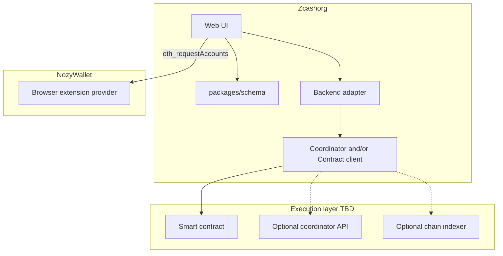

# Architecture

**Status:** Draft — execution layer **not locked**. See [OPEN_DECISIONS.md](./OPEN_DECISIONS.md).

## Overview

Zcashorg is a web dapp that lets users create shielded ZEC orgs with governance (members, proposals, votes, treasury). It integrates with **NozyWallet** as the wallet surface.

Unlike [DAO DAO](https://daodao.zone) on CosmWasm, Zcash does not have general-purpose smart contracts on mainnet today. A **smart contract approach is in progress** for this project — the split between on-chain enforcement and off-chain coordination is TBD.

## High-level diagram (current)



## Execution-layer options

| Pattern | On-chain | Off-chain | Fit |
|---------|----------|-----------|-----|
| **A — Coordinator only** | ZEC in shared UA / manual treasury | API + DB: members, votes, proposals | Fastest MVP; no contract VM |
| **B — Contract-primary** | Membership, votes, treasury rules | Indexer + UI cache | When contract target ships |
| **C — Hybrid** | Treasury + critical state on-chain | Metadata, notifications, privacy UX | Balance of enforcement + UX |

**Current stance:** design portable [data models](./DATA_MODEL.md) and a **backend adapter** so the UI does not depend on which pattern wins.

## Backend adapter (planned)

```typescript
interface OrgBackend {
  createFund(input: CreateFundInput): Promise<Fund>;
  getFund(slug: string): Promise<Fund>;
  listMembers(fundId: string): Promise<Member[]>;
  createProposal(fundId: string, input: CreateProposalInput): Promise<Proposal>;
  castVote(proposalId: string, vote: CastVoteInput): Promise<Vote>;
  finalizeProposal(proposalId: string): Promise<Proposal>;
  getTreasury(fundId: string): Promise<TreasuryMeta>;
  // executeProposal — added once custody path is known
}
```

Implementations (pick after OD-001 resolved):

- `CoordinatorBackend` — REST + Postgres
- `ContractBackend` — RPC + indexer
- `HybridBackend` — both

## Planned repo layout

```
Zcashorg/
├── packages/
│   ├── schema/              # Domain models + JSON Schema
│   └── sdk/                 # TS client for backend adapter
├── services/
│   ├── coordinator/         # Optional — if hybrid/off-chain
│   └── indexer/               # Optional — if contract-primary
├── contracts/                 # TBD — smart contract source
├── apps/
│   └── web/                 # Dapp UI
└── docs/plans/              # This folder
```

## Security notes

- Public web dapp must **not** call NozyWallet localhost companion REST (full wallet control).
- Use extension provider for connect / sign / send only.
- Fund API keys and invite tokens: hash at rest; short TTL on invites.
- Custody and UFVK disclosure require a dedicated security RFC before production.

## Related

- [DATA_MODEL.md](./DATA_MODEL.md)
- [NOZY_INTEGRATION.md](./NOZY_INTEGRATION.md)
- [ROADMAP.md](./ROADMAP.md)
