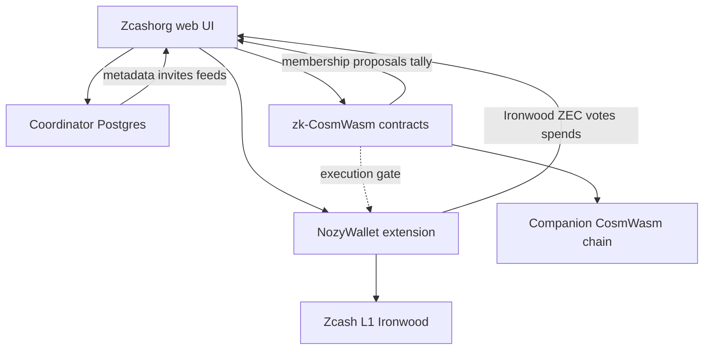

# Architecture

**Status:** **Locked — Hybrid C** (zk-CosmWasm + coordinator + Nozy). OD-001 provisional lock on Proof VM devnet. See [OPEN_DECISIONS.md](./OPEN_DECISIONS.md).

## Overview

Zcashorg is a web dapp for shielded ZEC orgs: members, proposals, votes, treasury actions. It integrates with **NozyWallet** for **Ironwood** shielded money and **zk-CosmWasm** on a companion chain for enforceable governance — without putting ZEC balances on a transparent ledger.

**Three layers:**

```
Zcashorg web UI
      │
      ├─► Coordinator (Postgres)     metadata, feeds, invites, notifications
      │
      ├─► zk-CosmWasm contracts      membership, proposals, tally, pass/fail, execution gate
      │
      └─► NozyWallet                 Ironwood ZEC, sign votes, execute spends
```

## Ironwood-only money rail

After NU6.3, spendable shielded ZEC is **Ironwood-pool notes** at unified addresses (`u1…`). Orchard cannot send for normal flows; legacy Orchard requires **ZIP 318** migration before spend.

| Area | Approach |
|------|----------|
| Treasury receive | Ironwood notes at fund `u1…` |
| `spend_intent` execute | Ironwood → Ironwood via Nozy |
| Member identity | `shielded_ua` (alias `orchard_ua` in schema) |
| CosmWasm | Authorization only — no ZEC custody on companion chain |

## What zk-CosmWasm solves

| Zcashorg need | Solution |
|---------------|----------|
| Members, roles, invites | Member commitments on contract; invites in coordinator |
| Proposals and votes | Authoritative tally and pass/fail on CosmWasm |
| `spend_intent` | Contract execution gate → Nozy Ironwood send → proof → `executed` |
| Privacy | ZK eligibility / private ballot without public UA ledger |
| `on_chain_*` fields | Real contract anchors |

**Does not solve alone:** treasury balance sync (LWD/indexer), pure Zcash-only governance stack, Crosslink staking, full E2E until Nozy proof glue ships.

## System diagram



## Execution patterns (reference)

| Pattern | On-chain | Off-chain | Notes |
|---------|----------|-----------|-------|
| A — Coordinator only | — | Everything | Fast MVP; trust API |
| B — Contract-primary | Governance rules | UI cache | No coordinator |
| **C — Hybrid** ★ | Membership, proposals, tally, execution gate | Metadata, invites, feeds | **Locked** |

## App flows

| Step | Behavior |
|------|----------|
| Create fund | Connect Nozy → UI + register fund on contract |
| Invite member | Invite link → accept with UA → member commitment on-chain |
| Propose spend | Proposal on contract + metadata in coordinator |
| Vote | ZK proof or signed attestation → contract tallies → pass/fail authoritative |
| Execute | Treasurer runs Execute → Nozy Ironwood tx → optional payment proof → `executed` + `txid` |

## Backend adapter

```typescript
interface OrgBackend {
  createFund(input: CreateFundInput): Promise<Fund>;
  getFund(slug: string): Promise<Fund>;
  listMembers(fundId: string): Promise<Member[]>;
  createProposal(fundId: string, input: CreateProposalInput): Promise<Proposal>;
  castVote(proposalId: string, vote: CastVoteInput): Promise<Vote>;
  finalizeProposal(proposalId: string): Promise<Proposal>;
  getTreasury(fundId: string): Promise<TreasuryMeta>;
}

interface HybridBackend extends OrgBackend {
  submitVoteProof(proposalId: string, proof: ZkVoteProof): Promise<Vote>;
  executeSpendIntent(proposalId: string, paymentProof?: PaymentProof): Promise<Proposal>;
  getExecutionGate(proposalId: string): Promise<{ may_execute: boolean }>;
}
```

Implementations:

- `CoordinatorBackend` — Phase 0–1 MVP (coordinator tally interim)
- **`HybridBackend`** — production path (coordinator + contract indexer + Nozy)
- `ContractBackend` — indexer-only read mode

## Repo layout

```
Zcashorg/
├── packages/schema/           # JSON Schema + TypeScript types + backend interfaces
├── packages/sdk/              # Coordinator client + HybridBackend adapter
├── services/coordinator/      # Metadata, invites, feeds, /v1 REST
├── services/indexer/          # CosmWasm events → domain model
├── contracts/zcashorg/        # zk-CosmWasm: fund, member, proposal, vote
├── apps/web/                  # Next.js dapp
└── docs/plans/
```

## Gleyo ecosystem

Zcashorg governs treasury allocations; [Gleyo](https://github.com/gilmorre/gleyo-Zechub-) runs quests and payouts. Budget moves to Gleyo after on-chain `gleyo_budget_allocate` pass. See [GLEYO_INTEGRATION.md](./GLEYO_INTEGRATION.md).

## Security

- Public web dapp must **not** call NozyWallet localhost companion REST.
- Extension provider for connect / sign / send only.
- ZEC never custodied on CosmWasm chain.
- Custody and UFVK disclosure require security RFC before production.

## Related

- [OPEN_DECISIONS.md](./OPEN_DECISIONS.md) — OD-001, OD-008
- [DATA_MODEL.md](./DATA_MODEL.md)
- [NOZY_INTEGRATION.md](./NOZY_INTEGRATION.md)
- [CONSTITUTION.md](./CONSTITUTION.md)
- [TOKEN_STRATEGY.md](./TOKEN_STRATEGY.md)
- [GLEYO_INTEGRATION.md](./GLEYO_INTEGRATION.md)
- [ROADMAP.md](./ROADMAP.md)
