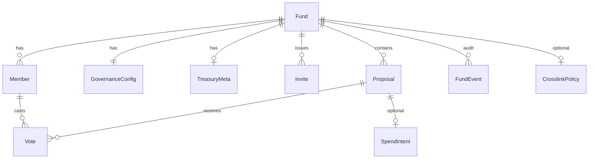

# Data model

**Status:** Draft v0 — portable across coordinator, contract, or hybrid backends.

## Conventions

- **IDs:** UUID v7 or ULID strings
- **Time:** ISO-8601 UTC
- **Amounts:** `zatoshis` as `u64` (1 ZEC = 100_000_000 zatoshis)
- **Network:** `mainnet` | `testnet`
- **Chain anchors** (nullable until contract spec): `on_chain_id`, `txid`, `block_height`

## Entity relationships



---

## Fund

Org / DAO / family group.

| Field | Type | Required | Notes |
|-------|------|----------|-------|
| `id` | string | yes | Primary key |
| `slug` | string | yes | URL-safe unique handle |
| `display_name` | string | yes | Human-readable name |
| `fund_type` | enum | yes | `family`, `business`, `investment_club`, `community` |
| `description` | string | no | Markdown-safe text |
| `status` | enum | yes | `active`, `archived` |
| `zns_name` | string | no | e.g. `smith.zcash` |
| `network` | enum | yes | `mainnet`, `testnet` |
| `on_chain_id` | string | no | Contract fund instance id |
| `created_by_member_id` | string | yes | Bootstrap member |
| `created_at` | datetime | yes | |
| `updated_at` | datetime | yes | |

---

## GovernanceConfig

One per fund. DAO DAO–style parameters.

| Field | Type | Default | Notes |
|-------|------|---------|-------|
| `fund_id` | string | — | FK → Fund |
| `quorum_percent` | u8 | 40 | Min turnout of eligible voting power |
| `pass_threshold_percent` | u8 | 67 | `yes / (yes + no)` |
| `voting_period_secs` | u32 | 604800 | 7 days |
| `min_voters` | u32 | null | Optional floor |
| `proposal_policy` | enum | `any_member` | `any_member`, `admins_only`, `owners_only` |
| `allow_abstain` | bool | true | |
| `voting_power_mode` | enum | `one_member_one_vote` | Extend for stake-weighted later |

**Note:** Crosslink network staking is **not** voting power in Phase 0.

---

## Member

| Field | Type | Required | Notes |
|-------|------|----------|-------|
| `id` | string | yes | |
| `fund_id` | string | yes | FK |
| `orchard_ua` | string | yes | Nozy-connected unified address (`u1…`) |
| `display_name` | string | yes | |
| `role` | enum | yes | `owner`, `admin`, `member`, `auditor`, `viewer` |
| `status` | enum | yes | `pending`, `active`, `removed` |
| `voting_power` | u32 | yes | Default 1 |
| `invited_by` | string | no | Member id |
| `on_chain_member_id` | string | no | Contract member id |
| `joined_at` | datetime | no | |

**Uniqueness:** `(fund_id, orchard_ua)` where `status != removed`.

### Roles

| Role | Propose | Vote | Invite | Admin | View treasury |
|------|---------|------|--------|-------|---------------|
| owner | yes | yes | yes | yes | yes |
| admin | yes* | yes | yes | yes | yes |
| member | yes* | yes | no | no | yes |
| auditor | no | no | no | no | yes |
| viewer | no | no | no | no | yes |

\*Subject to `proposal_policy`.

---

## Invite

| Field | Type | Required | Notes |
|-------|------|----------|-------|
| `id` | string | yes | |
| `fund_id` | string | yes | |
| `role` | enum | yes | Target role on accept |
| `token_hash` | string | yes | Store hash only |
| `expires_at` | datetime | yes | |
| `accepted_by_member_id` | string | no | |
| `status` | enum | yes | `open`, `accepted`, `expired`, `revoked` |

**Accept flow:** user connects Nozy → `POST /invites/:token/accept` with `{ orchard_ua }` → creates Member.

---

## TreasuryMeta

Metadata and balance tracking. **No custody enforcement in Phase 0.**

| Field | Type | Required | Notes |
|-------|------|----------|-------|
| `fund_id` | string | yes | 1:1 with Fund |
| `receive_ua` | string | no | Published deposit address |
| `balance_zatoshis` | u64 | yes | Default 0 |
| `balance_source` | enum | yes | `manual`, `indexer`, `contract`, `unconfigured` |
| `on_chain_treasury_ref` | string | no | Contract vault id |
| `last_synced_at` | datetime | no | |

---

## Proposal

| Field | Type | Required | Notes |
|-------|------|----------|-------|
| `id` | string | yes | |
| `fund_id` | string | yes | |
| `proposal_type` | enum | yes | See below |
| `title` | string | yes | |
| `description` | string | yes | |
| `status` | enum | yes | `draft`, `active`, `passed`, `rejected`, `expired`, `cancelled`, `executed` |
| `created_by_member_id` | string | yes | |
| `opens_at` | datetime | no | Set on activate |
| `closes_at` | datetime | no | |
| `execution_status` | enum | yes | `not_applicable`, `pending`, `completed`, `failed` |
| `payload` | JSON | yes | Type-specific |
| `on_chain_proposal_id` | string | no | |
| `tally` | object | no | Cached: `{ yes, no, abstain, eligible_power, turnout_percent }` |

### proposal_type values

| Type | Purpose | Phase 0 execution |
|------|---------|-------------------|
| `general` | Signal / discussion vote | None |
| `spend_intent` | Describe payout | **Deferred** |
| `member_add` | Add member | Off-chain / contract TBD |
| `member_remove` | Remove member | Off-chain / contract TBD |
| `role_change` | Change member role | Off-chain / contract TBD |
| `policy_change` | Update GovernanceConfig | Off-chain / contract TBD |
| `treasury_address` | Set receive UA | Off-chain / contract TBD |
| `crosslink_policy` | Staking policy placeholder | Deferred |

### Tally / pass logic

Proposal **passes** when:

1. `turnout_percent >= quorum_percent`, and
2. `yes / (yes + no) >= pass_threshold_percent`

(abstain counts toward turnout if `allow_abstain`; does not count in pass ratio)

---

## SpendIntent

Embedded in `Proposal.payload` when `proposal_type = spend_intent`.

```json
{
  "recipient_ua": "u1…",
  "amount_zatoshis": 100000000,
  "memo": "Q1 contractor payment",
  "expires_at": "2026-09-30T00:00:00Z"
}
```

**Reserved (Phase 3+):** `pczt_ref`, `txid`, `execution_member_id`, `contract_execution_hash`

---

## Vote

| Field | Type | Required | Notes |
|-------|------|----------|-------|
| `id` | string | yes | |
| `proposal_id` | string | yes | |
| `member_id` | string | yes | |
| `choice` | enum | yes | `yes`, `no`, `abstain` |
| `weight` | u32 | yes | Snapshot at vote time |
| `attestation` | object | no | `{ message, signature_hex, scheme: "nozy-sm-v1" }` |
| `on_chain_vote_id` | string | no | |
| `voted_at` | datetime | yes | |

**Uniqueness:** `(proposal_id, member_id)`.

---

## DepositRecord

Optional. Manual entry or indexer-synced deposits.

| Field | Type | Notes |
|-------|------|-------|
| `id` | string | |
| `fund_id` | string | |
| `txid` | string | |
| `amount_zatoshis` | u64 | |
| `block_height` | u64 | |
| `memo` | string | |
| `recorded_at` | datetime | |

---

## FundEvent

Append-only audit log for activity feeds.

| Field | Type | Notes |
|-------|------|-------|
| `id` | string | |
| `fund_id` | string | |
| `event_type` | string | e.g. `fund.created`, `vote.cast` |
| `actor_member_id` | string | Optional |
| `entity_type` | string | `fund`, `member`, `proposal`, `vote` |
| `entity_id` | string | |
| `payload` | JSON | Event-specific |
| `created_at` | datetime | |

---

## CrosslinkPolicy

Placeholder — schema only until Crosslink mainnet.

| Field | Type | Default | Notes |
|-------|------|---------|-------|
| `fund_id` | string | — | 1:1 |
| `enabled` | bool | false | |
| `max_stake_percent` | u8 | null | Cap on idle ZEC |
| `delegate_to` | string | null | Finalizer id |
| `notes` | string | null | Operator docs |

---

## Next: JSON Schema

When implementation starts, mirror these entities in `packages/schema/` as JSON Schema Draft 2020-12 with generated TypeScript types.
