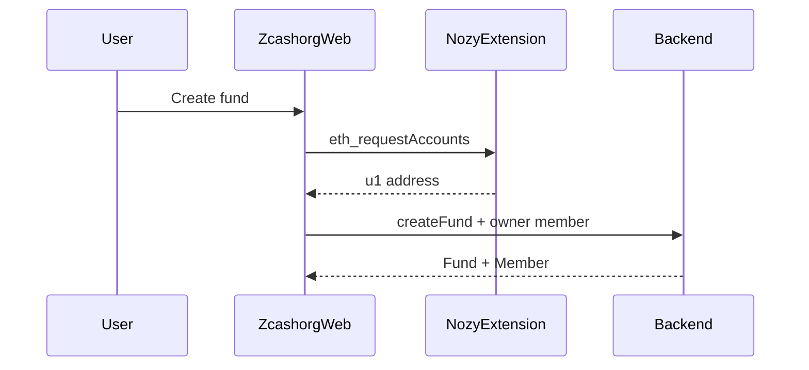
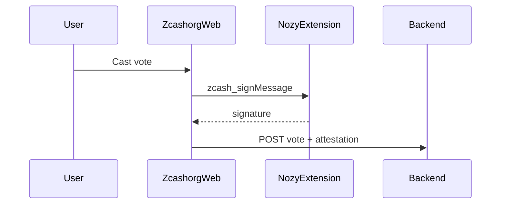

# NozyWallet integration

**Status:** **Locked — Hybrid C** (zk-CosmWasm + coordinator + Nozy). **Ironwood-only** shielded sends.

Zcashorg is a **standalone dapp** that uses NozyWallet as the wallet surface. It does not embed wallet logic and does not require changes to the Nozy-wallet core repo for Phase 0.

## Integration surface

| Surface | Use in Zcashorg | Public web dapp? |
|---------|-----------------|------------------|
| Browser extension provider (`window.nozy`) | Connect, sign, send | **Yes — primary** |
| EIP-6963 provider discovery | Detect Nozy among wallets | Yes |
| ZNS resolve | Display org / member names | Yes (public indexer or Nozy proxy) |
| Localhost companion REST (`nozywallet-api`) | Full wallet automation | **No — localhost only** |

## Connect flow (Phase 0)

```javascript
const provider =
  window.nozy ??
  window.ethereum ??
  (await discoverEip6963Provider("nozy-wallet"));

const accounts = await provider.request({ method: "eth_requestAccounts" });
const chainId = await provider.request({ method: "eth_chainId" }); // "0x5ba3" mainnet
```

Bind `accounts[0]` to `Member.shielded_ua` (alias `orchard_ua` in schema) when accepting invites or creating a fund.

### Provider methods (today)

| Method | Purpose |
|--------|---------|
| `eth_requestAccounts` / `zcash_requestAccounts` | Connect unified address |
| `eth_chainId` / `zcash_chainId` | Network check |
| `personal_sign` / `zcash_signMessage` | Vote attestations (Phase 1+) |
| `eth_sendTransaction` / `zcash_sendTransaction` | Spend after proposal pass (Phase 3+) |

User approval happens in the **extension popup** — the dapp never sees the seed.

## Sequence: create fund



## Sequence: vote (Phase 1+)



Canonical message format TBD in implementation issue; scheme target: `nozy-sm-v1` (see NozyWallet `signed_message.rs`).

## Sequence: execute spend (Phase 3+)

After proposal passes:

1. Initiator builds spend in Nozy (or dapp triggers `zcash_sendTransaction`).
2. Optional: PCZT co-sign for treasury policy (second approver).
3. Dapp records `txid` on proposal payload.

Reference: [NozyWallet MULTISIG_DESIGN](https://github.com/LEONINE-DAO/Nozy-wallet/blob/master/MULTISIG_DESIGN.md).

## Security rules

1. **Never** call `http://127.0.0.1:3000` companion API from a public website — it grants full wallet control to whoever holds the API key.
2. Treat connected `shielded_ua` as identity hint until signed attestations ship (Phase 1).
3. **Ironwood-only:** treasury and payouts must use Ironwood pool notes; block unmigrated Orchard (ZIP 318).
4. Shielded-only: reject transparent `t1` addresses for treasury and payouts.
5. Do not log seeds, PCZT bytes, or API keys.

## ZNS

- Resolve names for display: `smith.zcash` → unified address.
- NozyWallet exposes `POST /api/zns/resolve` on localhost companion; public dapp should use a public ZNS indexer when available.
- Linking a ZNS name to a fund is metadata (`Fund.zns_name`) — claim flow is out of scope for Phase 0.

## Desktop dapp browser (optional)

Nozy Desktop can embed dapps in an iframe with `nozy-provider.js` postMessage bridge. Same provider methods as extension. Feature-flagged in desktop client.

## Featured dapp listing

When Phase 2 web UI is usable, open an issue in [Nozy-wallet](https://github.com/LEONINE-DAO/Nozy-wallet) to add Zcashorg to landing/docs as a first-party dapp.

## References

- [NozyWallet browser extension provider](https://github.com/LEONINE-DAO/Nozy-wallet/tree/master/browser-extension/content)
- [COMPANION.md](https://github.com/LEONINE-DAO/Nozy-wallet/blob/master/browser-extension/COMPANION.md) — extension ↔ companion (not for public dapps)
- [FRONTEND_DEVELOPER_GUIDE.md](https://github.com/LEONINE-DAO/Nozy-wallet/blob/master/api-server/FRONTEND_DEVELOPER_GUIDE.md) — companion REST (local apps only)
